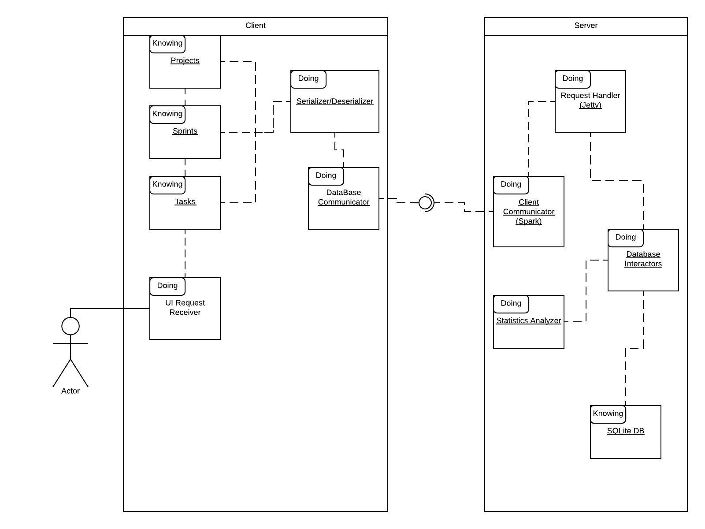
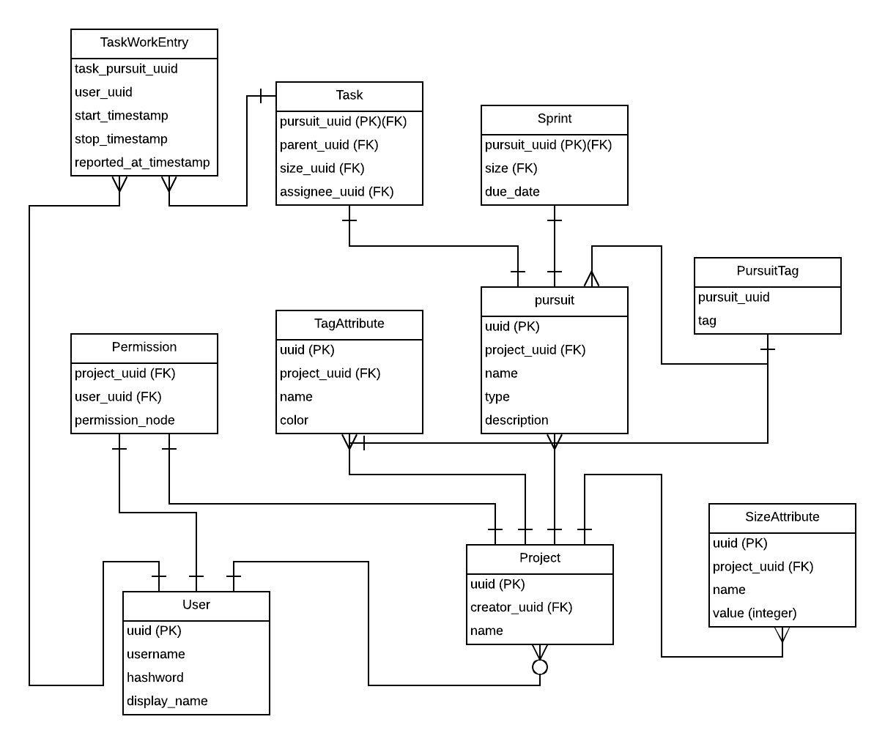
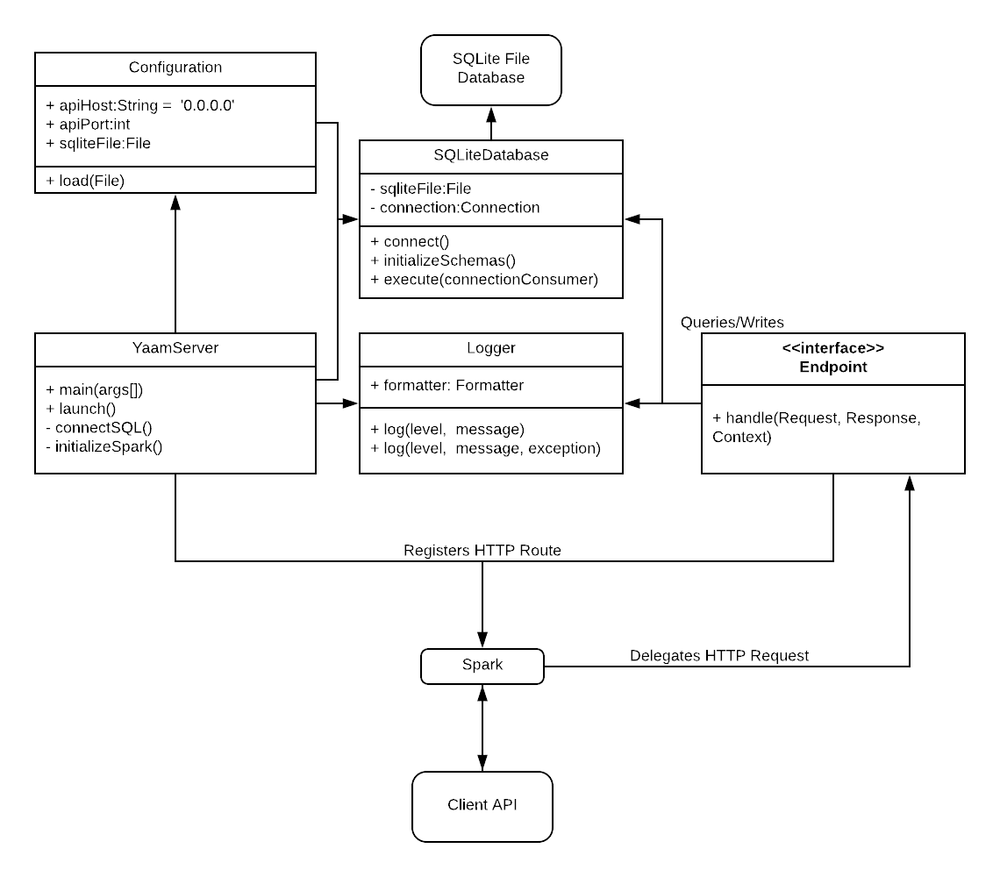
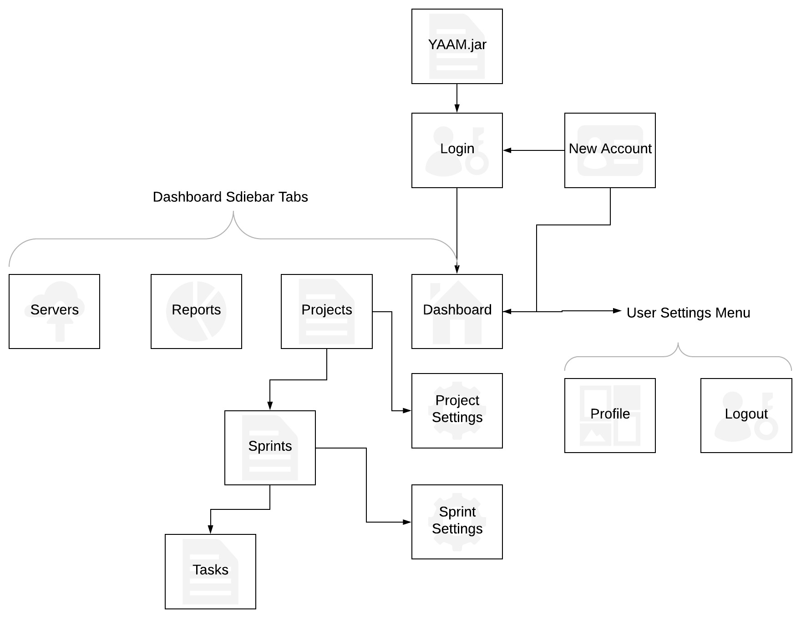
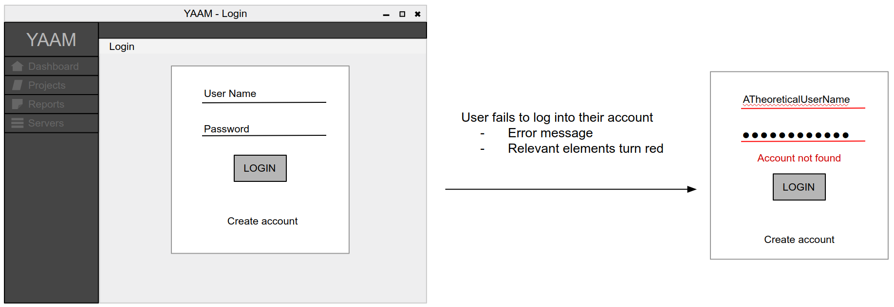
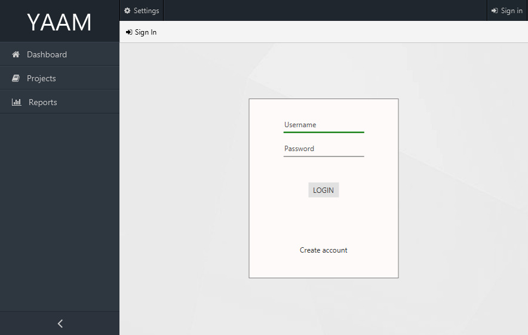
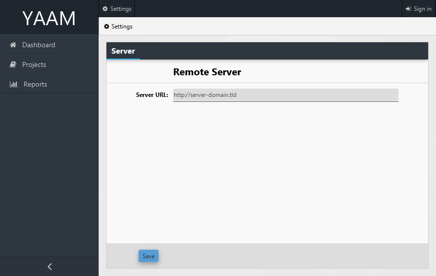

# Yet Another Agile Manager (YAAM)  
## Contributors
- [John P](https://github.com/JohnPCsus)
- [Lindsay Haven](https://github.com/lihaven)
- [Paul McHugh](https://github.com/paul-mchugh)
- [Ryan R](https://github.com/ryan-cr)
  
## Introduction
  The agile development process naturally tends to be both sporadic and volatile during the iterative design and implementation process. Project organization and group communication play critical roles in attempting to streamline the development process. The effective goal of the YAAM project is to create a task management software that can bridge the gap between development and organization for small development teams. The software is intended to allow managers and developers alike to organize project tasks and seamlessly track the time spent on completing them. Furthermore, the software will aggregate project task data into a complex statistical summary report for supervisors.
  
## Product Reviews  
### [Agilean](https://agilean.in/) 
Agilean is an online SaaS agile development team management system. Agilean comes in two flavors. The Kanban flavor and the scrum flavor. This changes how task progress is managed and viewed. Kanban supports a more continuous work flow, while scrum is more of a sprint style work flow.  We chose to review the Scrum flavor as that seemed to more closely correspond to sprints in Agile Development.  

##### Task Management  
Agilean allows many users to view the progress of the many projects. Users have roles for each project, Users are developers on some projects, but may be managers/team leads on other projects.  
On the requirements tab managers create Epics. Epics are assigned to projects. User Stories are assigned to epics. Tasks are assigned to user stories. And sub-tasks can be associated with tasks. Tasks are assigned story points.Tasks can be tagged with custom tags, and colored from a set of predefined colors, teams are able to use these in indicate whatever they need. A task may be tagged however a team finds useful.   

Managers then create Sprints and Releases, and assign tasks to them.  
- Projects → Epics → User Stories → Tasks (→ Sub-tasks)  
- Projects → Releases → Sprints → Tasks
- Projects → Impediments
   
##### Reporting  
Agilean offers many views of the project. The Requirements view displays all of the Epics, User Stories and Tasks. The board view displays all of the tasks in the current sprint on a swim lane board with lanes representing various levels of completion, from Backlog to Done. Agilean also offers a comprehensive reporting view, showing how many tasks are assigned to each developer, how many tasks are in each stage of completion, a burn-down chart, among others. 
  
  
### [RescueTime](https://www.rescuetime.com/)   
##### Overview
RescueTime is desktop time-management app intended to help users analyze their daily program usage habits. Although not necessarily intended for tracking time for projects or its various components, it is especially apt at recording time spent on relevant program usage data. The desktop application has minimal UI and serves as principally a usage recorder; all statistical aggregate data is viewed on their website's dashboard.

##### Time Tracking
RescueTime uses their desktop application to record time usage on all programs based on process image names and mouse and keystroke interaction. All program usage data is sent to their remote server under the user's registered account; since data is remotely stored, one user may use RescueTime from various computers and all their data is synchronized.

##### Statistical Aggregation
RescueTime's principal selling point is its complex interactive and exhaustive statistical aggregation breakdown. Its dashboard permits viewing both derived and raw data interactively. Its breakdown features apt usage of bar charts, pie charts, and graph statistics that can be viewed for a specific day, week, month, or year. Additionally, it categorizes various softwares into functionality groups (e.g. software development, communication & scheduling, utilities, entertainment).

 
### [Timesheet](https://www.timesheet.io/)  
#### Overview 
Timesheet is and individual user time tracking solution with a focus on tracking contract work. Although it includes a lot of features that probably won't want to consider for YAAM (including, but not limited to billing and expense tracking because the assumption is that YAAMs users are salaried), it is primarily a time and completed task tracking application. This makes it relevant our research because it's conceptually very similar to out first TM application in class, but with a GUI and some critical features added, primarily projects, tags, and GUIs on web and mobile.

The general first time user flow in Timesheet is for a user to create a project, maybe a tag or two, and then start tracking tasks with the timer, once tasks are stopped they will ask for tags and a description. Note that the mobile app is free, but the web app is not, therefore the mobile app with timer is the most common use case.

#### Structures flow
<table>
  <tr>
    <td colspan="6">
Projects hold
</td>
  </tr>
  <tr>
    <td colspan="6">
Tasks hold
</td>
  </tr>
  <tr>
    <td>Task Data</td>
    <td>Tags</td>
    <td>Breaks</td>
    <td>Expenses</td>
    <td>Notes</td>
    <td>Feelings</td>
  </tr>
</table>

#### Details on Major Features and Functions
__Timer:__ A time with start, stop and pause functionality allows a user to track their tasks in real time on their mobile phone (not available on web). If paused, once the task has been resumed the user can log some details about the break. Once a task has been stopped a user can log details about a task, including description of the task, change projects, start/stop times, etc.

__Tasks:__ There are two different task views available. The first is a summary list of tasks including task names, and minimal information on start/stop times, break times, tags, billing information, and description. The second is a calendar view (with week and month views) that allows more visibility into. Tasks also include information about expenses, billing, and happiness with the task performed which are not relevant to our research.

__Tags:__ Tasks can be tagged with custom tags, colored with an RGB color value system, teams are able to use these to indicate whatever they need and are used as a filter for statistics reporting. In addition, the properties of each tag includes a statistical review of what projects the tag was used on.

__Statistics:__ The statistics reporting is a major feature of Timesheet as it allows users to see how much overall time they are spending and where that time is going. Some of the more relevant features are: Date selections (several quick access predefined periods, as well as custom periods), Time Spent, Break Time, Progress (since it doesn't track goals, this is more like a sum of time spent day to day), Average Daily Working Hours, Time Spent Per Tag (a pie chart and hour break down text list), Projects (a pie chart and hour breakdown in text).

__Contracting:__ There are numerous features for contracting work that are not relevant to our project that aren't detailed here, but include: tracking if a task is billable and if it has been paid, hourly rates, overtime, and invoices.
down text).

## Project Overview  
YAAM is a client-server application with all data stored on a cloud server as a service. Customers will be able to create their own user accounts and run a client-side desktop application in order to access that server. The client will observe the developer and issue smart reminders to log work done when the developer uses IDEs, for example. This will allow us to bring  Rescue Times tracking ability, and TimeSheets intentional tracking with Agilean's application domain specific reporting, and project progress tracking.   
  
With automatic reminders tracking data will be more reliable. This will enable project leads to understand their teams velocity and generate more accurate predictions about future productivity. With online storage, YAAM will provide project managers with powerful options for communicating with their customers, and permissions will allow those customers to only see what information matters to them, without all of the technical details. 

## Project Architecture  
The project architecture for our software incorporates various ideas from both our team and our product reviews. Our architecture will make use a cloud-based client-server approach to maximize team collaboration and accessibility. All software implementations (client and server) will be written in Java 8, with the exception of the server's persistent data storage. The client's role is to provide the means for inputting and reviewing project data. The server's role is to serve as a database endpoint to synchronize all relevant project data to an entire development team.

#### Client
The only software client will be a JavaFX-driven GUI desktop application. Users will be able to create, edit, and interact with projects and tasks; behind the scenes, all modification data will be sent to the server to handle and store. The desktop application will serve to organize tasks, track time spent on tasks, and provide a statistical aggregation breakdown for tasks. The client will synchronize all modified project data with the cloud server through a client API module dependency.
##### UI Client
The following third-party softwares will be used in the UI client architecture:
- To provide a GUI with rich UI design:
  - **[JavaFX](http://www.oracle.com/technetwork/java/javase/overview/javafx-overview-2158620.html)**: "JavaFX is the next step in the evolution of Java as a rich client platform. It is designed to provide a lightweight, hardware-accelerated Java UI platform for enterprise business applications."
  - **[JFoenix](https://github.com/jfoenixadmin/JFoenix)**: "JFoenix is an open source Java library, that implements Google Material Design using Java components"
- To track time spent working on specific programs for tasks:
  - **[Java Native Access](https://github.com/java-native-access/jna) (JNA)**: "JNA provides Java programs easy access to native shared libraries without writing anything but Java code - no JNI or native code is required." (e.g. access platform specific libraries to track program interaction)
  - **[system-hook](https://github.com/kristian/system-hook)**: "Java (low-level) System Hook provides a very light-weight global keyboard and mouse listener for Java."

##### Client API
The following third-party softwares will be used in the client API architecture:
- **[JSON](https://github.com/stleary/JSON-java)**: "JSON is a light-weight, language independent, data interchange format." JSON will be used for data payloads for receiving and sending data to clients.
- **[async-http-client](https://github.com/AsyncHttpClient/async-http-client)**: "The AsyncHttpClient (AHC) library allows Java applications to easily execute HTTP requests and asynchronously process HTTP responses. The library also supports the WebSocket Protocol."

#### Server
The cloud server software will serve to store and retrieve all data related to users, projects, and tasks. Clients will send appropriate user data to the cloud server via a web server with a HTTP API endpoint that will process and store appropriate information. The web server will make use of embedded SQLite database to store all relevant data related to users, projects, and tasks.

The following third-party softwares will be used in the server architecture:
- To provide a HTTP API endpoint:
  - **[Embedded Jetty](https://www.eclipse.org/jetty/)**: Eclipse Jetty provides a Web server and javax.servlet container, plus support for HTTP/2, WebSocket, OSGi, JMX, JNDI, JAAS and many other integrations."
    - **[Spark](http://sparkjava.com/)**: "A micro framework for creating web applications in Kotlin and Java 8 with minimal effort." Spark (which runs on Jetty) will be used to mitigate the overhead of programmatically creating a Jetty server for the HTTP API.
  - **[JSON](https://github.com/stleary/JSON-java)**: "JSON is a light-weight, language independent, data interchange format." JSON will be used for data payloads for receiving and sending data to clients.
- To persistently store data:
  - **[SQLite](https://www.sqlite.org/index.html)**: SQLite is a embedded relational database management system.
  
  
## Project Requirements
| REQ-###    | Priority | Description                                                                                                                                                                                                           |
|------------|----------|-----------------------------------------------------------------------------------------------------------------------------------------------------------------------------------------------------------------------|
| **REQ-1**  | 20       | The cloud server application shall store and provide a record of projects, sprints, tasks, and their associated attributes.                                                                                           |
| **REQ-2**  | 14       | The desktop client application shall be the GUI access point for retrieving and modifying data (e.g. retrieve and modify the record of sprints, tasks, and their associated attributes) on the cloud server.          |
| **REQ-3**  | 13       | Users shall be able to register an account on the cloud server.                                                                                                                                                       |
| **REQ-4**  | 15       | Users shall be able to create a new project.                                                                                                                                                                          |
| **REQ-5**  | 10       | Users, as a the project creator, shall be able to invite or remove additional registered users to view (and potentially modify) a project.                                                                            |
| **REQ-6**  | 9        | Users who are project creators shall be able to set read, write, or other varying permissions for invited/added users.                                                                                                |
| **REQ-7**  | 17       | Users with appropriate permissions shall be able to create a sprint or task.                                                                                                                                          |
| **REQ-8**  | 7        | Users with appropriate permissions shall be able to specific attributes for sprints and tasks, such as descriptions, assignee(s), task size, due dates, and varying other properties.                                 |
| **REQ-9**  | 6        | Users with the appropriate permissions shall be able to specify additional attribute types on per-project basis. For example: creating customizable task sizes.                                                       |
| **REQ-10** | 19       | Users with the appropriate permissions shall be able to log the times when they started and stopped working on a task; they shall also be able to edit their own time task time histories to rectify clerical errors. |
| **REQ-11** | 16       | Users shall be able to view work summaries for a specific project, sprint, task, or user.                                                                                                                             |

__Priority justifications:__ Most important is anything that was part of the original TM program and adding agile functionality, the second most important thing is the cloud server implementation because it's easy and helps teams work together better, the third most important thing is that the program be able to support multiple projects and then multiple teams, finally it's important to manager user permissions so teams don't have to worry about correcting mistakes or misunderstandings with changes made by inexperienced or uninformed users. 

##### Possible Future Requirements
| REQ-###     | Description                                                                                                                                                                                                                                                                                                                                                                        |
|-------------|------------------------------------------------------------------------------------------------------------------------------------------------------------------------------------------------------------------------------------------------------------------------------------------------------------------------------------------------------------------------------------|
| **REQ-XX1** | Users with the appropriate permissions will be able to define and attach custom tags to tasks, on a per-project basis.                                                                                                                                                                                                                                                             |
| **REQ-XX2** | Users shall be able to track time spent on tasks by checking user software interactivity                                                                                                                                                                                                                                                                                           |
| **REQ-XX3** | The client application shall run in the background on the developers computer and shall use heuristics to determine if the developer is working on a task assigned to them.  If it makes such a determination and the developer **has not** logged work as being in progress the application shall send the a notification that will remind them to log work as being in progress. |

## Use Cases
### Actors
- **Anyone** - Generally meaning anyone or thing acting as a human person
- **RegUser** - Generally meaning anyone who has registered and has a valid user account
- **Developer** - Generally meaning the user with the lowest permissions for a project
- **Manager** - Generally meaning the user with a high level of permissions for a project
- **Server** - The data warehouse manager
- **Client** - The customer service associate

### Derived Use Cases From Requirements
|Actor     |Actor's Goal                                                                            |Use Case Name         |
|----------|----------------------------------------------------------------------------------------|----------------------|
|RegUser   |Will be able to create projects and have them saved on the server.                      |CreateProj(UC1)       |
|Manager   |Will be able to create sprints and have them saved on the server.                       |CreateSprints(UC2)    |
|Developer |Will be able to create tasks and have them saved on the server.                         |CreateTasks(UC3)      |
|Developer |Will be able to create and modify task attributes and have them saved on the server.    |ModTaskAttrib(UC4)    |
|Developer |Will be able to move a task from one sprint (or backlog) to another.                    |MoveTasks(UC5)        |
|Manager   |Managers will be able to edit a sprints attributes such as its due date and name.       |EditSprints(UC6)      |
|Anyone    |Is able register a new account through the desktop client with minimal Personal information.|RegAccout(UC10)   |
|RegUser   |Will be able to log into their account on the client application.                       |OpenDsktpClient(UC11) |
|Developer |Users will be able to view the state of projects they are a part of.                    |ViewProject(UC12)     |
|Manager   |Should be able to invite additional register users to access a project                  |InviteToProj(UC14)    |
|RegUser   |Should be able to see notifications about invitations to projects.                      |InviteNotify(UC16)    |
|Manager   |Should be able to manager permissions and access of other users on a project.           |MngProjUsers(UC17)    |
|Manager   |Will be able to customize task sizes as project parameters.		     		            |DefineSizes(UC18)     |
|Manager   |Will be able to customize tags as project parameters.			                	    |DefineTags(UC20)      |
|Developer|Start work on a task.								                                    |StartTask(UC22)       |
|Developer|Stop work on a task.								                                        |StopTask(UC23)        |
|Developer|Edit start and stop times on a task.					 	                                |EditTaskTimes(UC24)   |
|Developer|Add start and stop time on a task in the even they forgot to log the task entirely.	    |AddTaskTimes(UC25)    |
|Developer|View statistical summaries page.						                             	    |ViewStats(UC26)       |
|Developer|Manage view using filters with various project, sprint, and task attributes.	            |FilterStats(UC27)     |

### Traceability Matrix
|Req't|REQ1 |REQ2 |REQ3 |REQ4 |REQ5 |REQ6 |REQ7 |REQ8 |REQ9 |REQ10|REQ11|Max PW|Total PW|
|----:|:---:|:---:|:---:|:---:|:---:|:---:|:---:|:---:|:---:|:---:|:---:|------|--------|
|PW   | 20  | 14  | 13  | 15  | 10  |  9  | 17  |  7  |  6  | 19  | 16  | ---- | ------ |
|UC1  | x   | x   |     |  x  |     |     |     |     |     |     |     |      |        | 
|UC2  | x   |     |     |     |     |     | x   |     |     |     |     |      |        |
|UC3  | x   |     |     |     |     |     | x   |     |     |     |     |      |        |
|UC4  | x   |  x  |     |     |     |     |     |  x  |     |     |     |      |        |
|UC5  | x   |  x  |     |     |     |     |     |  x  |     |     |     |      |        |
|UC6  | x   |  x  |     |     |     |     |     |  x  |     |     |     |      |        |
|UC10 | x   |  x  |  x  |     |     |     |     |     |     |     |     |      |        |
|UC11 | x   |     |     |     |     |     |     |     |  x  |     |     |      |        |
|UC12 | x   |     |     |     |     |     | x   |     |     |     |     |      |        |
|UC13 |     |     |     |     |     |     |     |     |     |     |     |      |        |
|UC14 | x   |     |     |     |  x  |     |     |     |     |     |     |      |        |
|UC16 | x   |     |     |     |  x  |     |     |     |     |     |     |      |        |
|UC17 | x   |     |     |     |  x  |  x  |     |     |     |     |     |      |        |
|UC18 | x   |     |     |     |     |     |     |     |  x  |     |     |      |        |
|UC20 | x   |     |     |     |     |     |     |     |  x  |     |     |      |        |
|UC21 | x   |     |     |     |     |     |     |  x  |     |     |     |      |        |
|Uc22 | x   |     |     |     |  x  |     |     |     |     |     |     |      |        |
|UC23 | x   |     |     |     |  x  |     |     |     |     |     |     |      |        |
|UC24 | x   |     |     |     |     |     |     |     |     |  x  |     |      |        |
|UC25 | x   |     |     |     |     |     |     |     |     |  x  |     |      |        |
|UC26 |     |  x  |     |     |     |     |     |     |     |     |  x  |      |        |
|UC27 |     |  x  |     |     |     |     |     |     |     |     |  x  |      |        |

### Detailed Use Cases
---

| UC-1                 | Create Project                         |
|----------------------|----------------------------------------|
| Related Requirements | REQ-1, REQ-2, REQ-4                    |
| Initiating Actor     | Regular User                           |
| Actor's Goals        | Create an Empty Project                |
| Participating Actors | None                                   |
| Preconditions        | User must have an account              |
| Postconditions       | User is manager within the new Project |
##### Flow of Events
1. → User: selects Create Project
2. ← System: displays Form to User
3. User: completes Form
4. → User: submits Form
5. ← System:
	* (a) creates Project 
	* (b) signals to User Project Created
##### Extensions
5(b).
1. ← System: 
    * (a) signals that account information is incomplete/not unique
	* (b) returns form to user  
3.  Return to 3
---

| UC-2                 | Create Sprint                        |
|----------------------|--------------------------------------|
| Related Requirements | REQ-1, REQ-7                         |
| Initiating Actor     | Manager                              |
| Actor's Goals        | Create a Sprint within a Project     |
| Participating Actors | None                                 |
| Preconditions        | A project must already exist         |
| Postconditions       | A sprint is created within a project |
##### Flow of Events
1. → User: selects create Sprint
2.  System: checks if User has permissions to create Sprint
3. ← System: sends form to Manager 
4. Manager: completes required fields 
5. → Manager: submits form
6. System: creates Sprint
##### Extensions
3a. 
1. System Checks if User has permissions to create sprint
2. ← System: indicates that Sprint cannot be created

6a.
1. ← System returns incomplete or non-unique form
2. → User submits completed form
---

| UC-3                 | Create Task                                                                      |
|----------------------|----------------------------------------------------------------------------------|
| Related Requirements | REQ-1, REQ-7                                                                     |
| Initiating Actor     | Anyone                                                                           |
| Actor's Goals        | Create task within a project                                                     |
| Participating Actors | None                                                                             |
| Preconditions        | Actor have sufficient permissions within the project, project must exist already |
| Postconditions       | Task is created on server and associated with project                            |
##### Flow of Events
 1. → User: selects create task function
 2. ← System: displays a form to user
 3. User: fills out Form
 4. → User: submits Form
 5. ← System: 
	 * (a) system stores task information
	 * (b) signals completions
##### Extensions   
5(b).
1. ← System: 
	* (a) signals that account information is incomplete/not unique
	* (b) returns form to user  
2.  return to step 3
---

| UC-4                 | ModTaskAttrib                          |
|----------------------|----------------------------------------|
| Related Requirements | REQ-1, REQ-2, REQ-8                    |
| Initiating Actor     | Developer                              |
| Actor's Goals        | Set the size,due date, tags, of a task |
| Participating Actors | none                                   |
| Preconditions        | a task must exist                      |
| Postconditions       | task attributes will be updated        |
##### Flow of Events
1. → User: selects a task
2. ← System: displays task detailed view
3. → User: 
	* (a) selects attribute to change
	* (b) selects new value for attribute
4. System: updates value of task attribute
---
| UC-5                 | Move Task to sprint/backlog                                                                |
|----------------------|--------------------------------------------------------------------------------------------|
| Related Requirements | REQ-1, REQ-2, REQ-8                                                                        |
| Initiating Actor     | Developer                                                                                  |
| Actor's Goals        | To move a task either off of the backlog and into a sprint, or vice-versa                  |
| Participating Actors | None                                                                                       |
| Preconditions        | Tasks must already exist, a sprint must already exist, user must have adequate permissions |
| Postconditions       | a sprint will have a given task associated with it                                         |
##### Flow of Events
1. → User: selects sprints
2. ← System: displays sprints, and backlog
3. → User: selects sprint and destination (backlog/sprint)
4. ← System:
	* (a) moves task into indicated sprint
	* (b) indicates to user that sprint has been moved
---

| UC-6                 | Edit Sprint Attributes                                             |
|----------------------|--------------------------------------------------------------------|
| Related Requirements | REQ-1, REQ-2, REQ-8                                                |
| Initiating Actor     | Manager                                                            |
| Actor's Goals        | change the attributes (due date,name, etc.) of a sprint            |
| Participating Actors | None                                                               |
| Preconditions        | A sprint must already exist, user must have sufficient permissions |
| Postconditions       | System will record changes to sprints attributes                   |
##### Flow of Events
1. → User: selects sprint to change
2. ← System: displays sprint and associated data
3. → User:
	* (a) selects information to alter
	* (b) enters new value
4. ← System: 
	* (a) records new value(s)
	* (b) indicates to user that change is complete
---

| UC-10                | Register Account                                                                                |
|----------------------|-------------------------------------------------------------------------------------------------|
| Related Requirements | REQ-1, REQ-2, REQ-3                                                                             |
| Initiating Actor     | Anyone                                                                                          |
| Actor's Goals        | Create an account on the server                                                                 |
| Participating Actors | None                                                                                            |
| Preconditions        | Actor must not already have an account on the server                                            |
| Postconditions       | User Account information stored by the server, User is given Manager permissions in new Project |
##### Flow of Events
 1. → User: selects create account function
 2. ← System: displays a form to user
 3. User: fills out Form
 4. → User: submits Form
 5. ← System: 
	 * (a) stores account information 
	 * (b) signals completions
##### Extensions   
5(b).
1. ← System: 
	* (a) signals that account information is incomplete/not unique
	* (b) returns form to user  
2.  return to step 3
---

| UC-11                | OpenDsktpClient                       |
|----------------------|---------------------------------------|
| Related Requirements | REQ-2                                 |
| Initiating Actor     | RegUser                               |
| Actor's Goals        | To open and log into their client     |
| Participating Actors | None                                  |
| Preconditions        | The user is registered.               |
| Postconditions       | The user is logged into their client. |
##### Flow of Events
1. → User: launches client application
2. ← System: prompts User to log in
3. → User: enters Username and Password
4. ← System: validates username and password, logs the user in, and stores a login token on User's computer
##### Extensions
4a.
1. ← System reject username/password pair as invalid
2. return to step 2

---
| UC-12                | ViewProject                                                                                                        |
|----------------------|--------------------------------------------------------------------------------------------------------------------|
| Related Requirements | REQ-1, REQ-7                                                                                                       |
| Initiating Actor     | Developer                                                                                                          |
| Actor's Goals        | To see an overview of the project they are working on including the Tasks, Sprints and Backlog that constitute it. |
| Participating Actors | None                                                                                                               |
| Preconditions        | The user is logged in and has access to the project.                                                               |
| Postconditions       | None                                                                                                               |
##### Flow of Events
1. → User: selects the project
2. ← System: displays a summary of all the Backlog, Sprints, and Tasks that are part of the project.
---

| UC-14                | InviteToProj                                               |
|----------------------|------------------------------------------------------------|
| Related Requirements | REQ-1,REQ-5                                                |
| Initiating Actor     | Manager                                                    |
| Actor's Goals        | To add a new Developer to their project                    |
| Participating Actors | RegUser                                                    |
| Preconditions        | The desired used is not part of the project in question    |
| Postconditions       | The desired User will be able to join the relevant project |
##### Flow of Events
1. → Manager: selects the invite user action for their project
2. Server: checks that the user is a manager and has appropriate permissions
3. ← Client: displays the invite user menu
4. → Manager: enters the user name of the relevant user
5. ← Server: sends confirmation message
---

| UC-16                | InviteNotify                                                                                                                              |
|----------------------|-------------------------------------------------------------------------------------------------------------------------------------------|
| Related Requirements | REQ-1,REQ-5                                                                                                                               |
| Initiating Actor     | Manager                                                                                                                                   |
| Actor's Goals        | To add the desired new Developer to their team                                                                                            |
| Participating Actors | RegUser                                                                                                                                   |
| Preconditions        | Manager invite to the new programmer                                                                                                      |
| Postconditions       | RegUser is notified that they have an invitation to become a Developer on the relevant project. New Developers Permissions set to Default |
##### Flow of Events
1. → Manager: finishes sending invite
2. ← Server: sends invite once the target user's client is connected to the network
3. → Target: user accepts invite
---

| UC-17                | Manage Project Users                                 |
|----------------------|------------------------------------------------------|
| Related Requirements | REQ-1, REQ-5, REQ-6                                  |
| Initiating Actor     | Manager                                              |
| Actor's Goals        | Set permissions for developers on the users projects |
| Participating Actors | None                                                 |
| Preconditions        | Project must exist, with Users                       |
| Postconditions       | Developers permissions on the Project changed        |
##### Flow of Events
1. → Manager: Selects Manage Developers on Project
2. ← System: presents a list of users on the project
3. → Manager: selects user they wish to edit
4. ← System: presents available options to manager
5. → Manager: selects permission they'd like to change and new value
6. ← System:
    * (a) updates permissions for user
    * (b) indicates to Manager that changes have been logged
---

| UC-18                | Define Sizes                                                      |
|----------------------|-------------------------------------------------------------------|
| Related Requirements | REQ-1, REQ-9                                                      |
| Initiating Actor     | Manager                                                           |
| Actor's Goals        | Define a size system for a project                                |
| Participating Actors | None                                                              |
| Preconditions        | Project must already exist, user must have sufficient permissions |
| Postconditions       | size system defined and associated with project                   |
##### Flow of Events
1. → User: selects project
2. ← System: displays project 
3. → User: selects add tag
4. ← system: Displays form
5. → User: 
	* (a) fills out form (indicating size names and associating integers with them)
	* (b) submits form
6. ← System:
	* (a) creates size within project
	* (b) indicates to user that size created
##### Extensions
6(b).
1. ← System:
	* (a) indicates that form is incomplete
	* (b) system returns form
2. return to step 5
---

| UC-20                | Define Tags                                                       |
|----------------------|-------------------------------------------------------------------|
| Related Requirements | REQ-1, REQ-9                                                      |
| Initiating Actor     | Manager                                                           |
| Actor's Goals        | create a new tag, for a project                                   |
| Participating Actors | None                                                              |
| Preconditions        | Project must already exist, user must have sufficient permissions |
| Postconditions       | new tag is defined and associated with project                    |
##### Flow of Events
1. → User: selects project
2. ← System: displays project 
3. → User: selects add tag
4. ← system: Displays form
5. → User: 
	* (a) fills out form
	* (b) submits form
6. ← System:
	* (a) creates tag within project
	* (b) indicates to user that tag created
##### Extensions
6(b).
1. ← System:
	* (a) indicates that form is incomplete/non-unique
	* (b) system returns form
2. return to step 5
---

| UC-21                | Set Task Tags                                   |
|----------------------|-------------------------------------------------|
| Related Requirements | REQ-1, REQ-8                                    |
| Initiating Actor     | Manager,Developer                               |
| Actor's Goals        | Associate a given tag with a given task         |
| Participating Actors | None                                            |
| Preconditions        | Tag must already exist, task must already exist |
| Postconditions       | System records that tag is associated with task |
##### Flow of Events
1. → User: selects task to tag
2. ← System: presents Options for Task
3. → User: selects add tag
4. ← System: presents available tags
5. → User: selects desired tag
6. ← System:
	* (a) associates tag with task
	* (b) indicates to user that task is now tagged
---

| UC-22                | Start Work on a Task                           |
|----------------------|------------------------------------------------|
| Related Requirements | REQ-5, REQ-1                                   |
| Initiating Actor     | Developer                                      |
| Actor's Goals        | Log the time the actor began working on a task |
| Participating Actors | none                                           |
| Preconditions        | A Task must exist                              |
| Postconditions       | start time is logged and saved                 |
##### Flow of Events
1. → User: selects the task that they want to begin 
2. ← System: presents options for task
3. → User: selects start work
4. System logs start time
##### Extensions
(4b). 
1. ← System: indicates to user that task is already started
---

| UC-23                | Stop Work on a Task                                |
|----------------------|----------------------------------------------------|
| Related Requirements | REQ-1, REQ-5                                       |
| Initiating Actor     | Developer                                          |
| Actor's Goals        | Log the time user stopped working on a task        |
| Participating Actors | None                                               |
| Preconditions        | Task must have already been started by user(UC-22) |
| Postconditions       | Stop time logged by system                         |
##### Flow of Events
1. → User: selects the task that they want to stop 
2. ← System: presents options for task
3. → User: selects stop work
4. System logs stop time
##### Extensions
(4b). 
1. ← System: indicates to user that task is already stopped
---

| UC-24                | EditTaskTimes                                                         |
|----------------------|-----------------------------------------------------------------------|
| Related Requirements | REQ-1,REQ-10                                                          |
| Initiating Actor     | Developer                                                             |
| Actor's Goals        | Edit start and stop time entries for a task to correct erroneous data |
| Participating Actors | None                                                                  |
| Preconditions        | task must already exist with times logged                             |
| Postconditions       | Selected Time entries will be updated                                 |
1. → User: indicates task to edit
2. ← System: displays detailed information about task
3. → User: User indicates times to change
4. ← System: 
	* (a) updates times 
	* (b) indicates to user that times are logged.
##### Extensions
(4b).
1. ← System: indicates to user that times cannot be saved due to overlap. See UC-22, UC-23.
---

| UC-25                | Add task times                                                |
|----------------------|---------------------------------------------------------------|
| Related Requirements | REQ-1, REQ-10                                                 |
| Initiating Actor     | Developer                                                     |
| Actor's Goals        | Enter data for work that was not recorded due to a user error |
| Participating Actors | None                                                          |
| Preconditions        | task must exist                                               |
| Postconditions       | a new start and stop time will be added to the task           |
##### Flow of Events
1. → User: indicates task to edit
2. ← System: displays detailed information about task
3. → User: indicates times to add 
4. ← System: 
	* (a) adds times to task see (UC-22, UC-23)
	* (b) indicates to user that times are logged
---

| UC-26                | View Statistics                                                            |
|----------------------|----------------------------------------------------------------------------|
| Related Requirements | REQ-11, REQ-2                                                              |
| Initiating Actor     | Developer/Manager                                                          |
| Actor's Goals        | View Detailed Statistics about Tasks, projects                             |
| Participating Actors | None                                                                       |
| Preconditions        | Actor must have appropriate permissions to access given tasks and projects |
| Postconditions       | Detailed statistics are returned to the User                               |
##### Flow of Events
1. → User: selects statistics
2. ← System: displays Statistics for all projects and tasks User has permissions to view (which could be none)
---

| UC-27                | Filter Statistics                                                                                                                                       |
|----------------------|---------------------------------------------------------------------------------------------------------------------------------------------------------|
| Related Requirements | REQ-11, REQ-2                                                                                                                                           |
| Initiating Actor     | Developer/Manager                                                                                                                                       |
| Actor's Goals        | Change which tasks/projects/sprints are included in statistics                                                                                          |
| Participating Actors | None                                                                                                                                                    |
| Preconditions        | Actor must have appropriate permissions to view projects; Actors view is displaying the statistics screen, Statistics Screen Displays available filters |
| Postconditions       | View will be updated and limited to the given parameters                                                                                                |
##### Flow of Events
1. → User: selects a filter (filter out project etc, include project etc)
2. System: calculates statistics based on filters
3. ← System: displays filtered Statistics
---

## Domain Model    

#### Responsibilities:
##### UI Request Receiver:
Respond to User requests by passing Commands to the Correct modules, and passing updated information to the user interface  
##### Tasks/Sprints/Projects:
Store information pertaining to the task/sprint/project in question. Notify other modules of changes to those tasks.
##### Serializer/Deserializer:
The Serializer/Deserializer module translates messages from the desktop application into transmittable form, and translates messages form the Server into usable form.
##### Database Communicator:
The Database Communicator module creates proper HTTP requests from the transmittable form created by the serializer, it also receives HTTP responses form the server and extracts the message to be translated by the deserializer.
##### Client Communicator:
This module receives network messages and forewards them to the correct recipient.
##### Request Handler:
This module receives forewards from the Client Communicator and Gives it to the Handler who knows how to respond. It also forwards those responses back to the Client Communicator.
##### Database Interacters: 
These modules interpret the messages forwarded by the Request Handler and gets or puts the correct information from or into the database.
##### Statistics Analyzer:
This module will perform any statistical calculations that need to be made on Database Data before transmission.

## System Design  
### Database Diagram  
 
### Server API

## Algorithms and Data Structures  
If your system has any complex algorithms, e.g., statistical inference, you will ned to describe them in detail here. You will also need to describe your data model in detail here. How are you storing your data and why? How do your choices mitigate issues that we faced in our original implementation of TM.  

Possible concepts to flesh out:
- recursively building a tree of sprints/tasks in memory based on their parent pursuit uuids
- statistical average/sums
- storing deserialized data in memory using model objects (User, Project, Sprint) rather than interpreting strings from a log file

## User Interface Design and Implementation 
### Flow Diagram

Interactions are modeled with an arrow are a required path. For instance, you must launch the YAMM.jar file before you login and you must login before you access the dashboard. Page representationsw with no arrow to them indicate optional access and should be grouped with a horizontal curly brace to indicate what page they can be accessed from. 

UI flow mocked up with lucid chart becuase it has good support for flow diagrams. 

Some UI Requirements that have UI Flow implications:
- User cannot access anything below login without successfully logging in.
- User can access any of the Sidebar tabs at any time (Sidebar is always visible). 
- User can access User Settings at any time (User Settings menu always visible).

### Mockups
UI mockups were done in Google Drawing because it’s free to use, easy to place elements as needed, cross platform, and very collaborative. We considered using Visio, but it’s harder to find free copies and it’s not as cross platform or collaborative. 

The user login will be the first page that the user sees when they launch the application. All of the application accessible via the side bars or menus will be inaccessible until the user logs in. In this drawing that’s been represented by both dimming the sidebar tabs and by removing the user profile menu.

### Implementation
A rough implementation of the designed mockup

## Progress Report and Plan of Work
### Progress Report
#### Desktop Client
The responsive desktop client UI framework has been implemented in JavaFX, which has a simplistic material UI design and a navigation system built in for "pages". 
##### Actual screenshots of YAAM

##### Issues being tackled
- integrating the client-api into the desktop-client
    - hooking up login/create account page
- allowing program minimization to tray icon
- designing more complex UI views/"pages"

#### Client API

#### Server API
The SQLite database schematics for the entire data backend have been written and revised. A layer on top of Spark's HTTP layer was implemented to allow a modular framework for constructing new API endpoints. A small subset of the planned API endpoints have been fleshed out.

##### Issues being tackled
- implementing simpler API endpoints
- user authentication system

### Plan of Work  
#### Desktop Client
By next week, the following goals are aimed to be implemented:
- finish fleshing out the full UI experience (minimization to tray icon, user dropdowns)
- integrating into the client-api module and support a few simple use cases
- attempt bundling application script to produce a final product

#### Client API

#### Server API 
1. all GET http requests will be implemented. 
2. implement all POST http requests.
3. Authentication will be last priority.

### Breakdown of Responsibilities  
- **John**: Developing and testing HTTP YAAM API endpoint requests under the Server API module; additionally, using and verifying integrity of the SQLite schemas
- **Lindsay**: Developing and testing UI views for user login, account creation, and user profile settingsm under the Desktop Client module.
- **Paul**: Developing and testing communicating with the Server API through HTTP requests and representing deserialized data into memory data structures, under the Client API module.
- **Ryan R**: Developing and testing the UI views for data pulled from the integrated Client API, under the Desktop Client. Developing and testing the Server API framework for handling requests.

Individual team members will coordinate integrating their respective responsibilities together (e.g. John and Paul will work together to integrate the server-api and client-api). Our team and various testing users will perform testing of the integrated software.